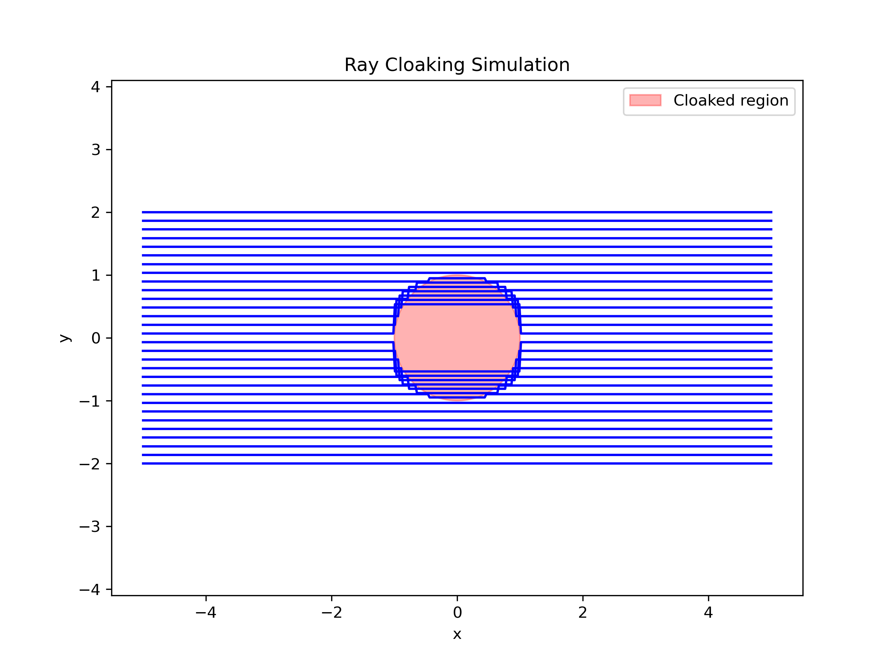
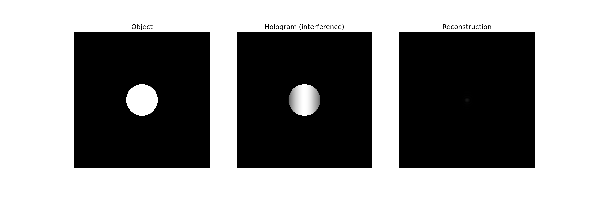

📄 Abstract
This project presents a dual-module simulation that explores two foundational concepts in computational optics: ray cloaking and digital holography. The first module models the behavior of parallel light rays as they bend around a circular cloaked region, demonstrating how spatial geometry and refractive principles can redirect optical paths to conceal objects. The second module simulates the formation and reconstruction of a digital hologram, where a circular object interferes with a reference wave to produce an intensity pattern from which the object can be computationally recovered using Fourier techniques.
Together, these simulations offer a unified framework for visualizing both geometric and wave-based approaches to optical concealment and recovery. The ray tracing module provides intuitive insight into refractive cloaking, while the holography module introduces core principles of interference, diffraction, and inverse reconstruction. An animated ray visualization further enhances interpretability. This project reflects a strong foundation in numerical modeling, wavefront analysis, and scientific visualization skills essential for graduate-level research in photonics, holography, and computational imaging.

To save animations as MP4, ensure FFmpeg is installed and accessible in your system path.

🚀 How to Run
Run the script: main.py

This will execute:
• 	Ray cloaking simulation ()
• 	Hologram formation and reconstruction ()
• 	Ray animation ()
All outputs are saved in the working directory.

📂 Output Files

## 📚 Concepts Illustrated
• 	Ray optics and refractive cloaking
• 	Wave interference and hologram formation
• 	Fourier-based reconstruction
• 	Visualization of inverse problems
• 	Scientific animation and interaction

# 🎓 Research Relevance
This project demonstrates key competencies in:
• 	Computational modeling of optical systems
• 	Wavefront analysis and signal recovery
• 	Algorithmic design for inverse imaging
• 	Scientific visualization and animation

# 👤 Author
Developed by Alhassan Kpahambang fuseini An aspiring graduate student in physics or appied physics, inverse problems, and photonic imaging systems, Optics, Computational Optics. 

📄 License
This project is licensed under the MIT License. Feel free to use, modify, and share with attribution.
